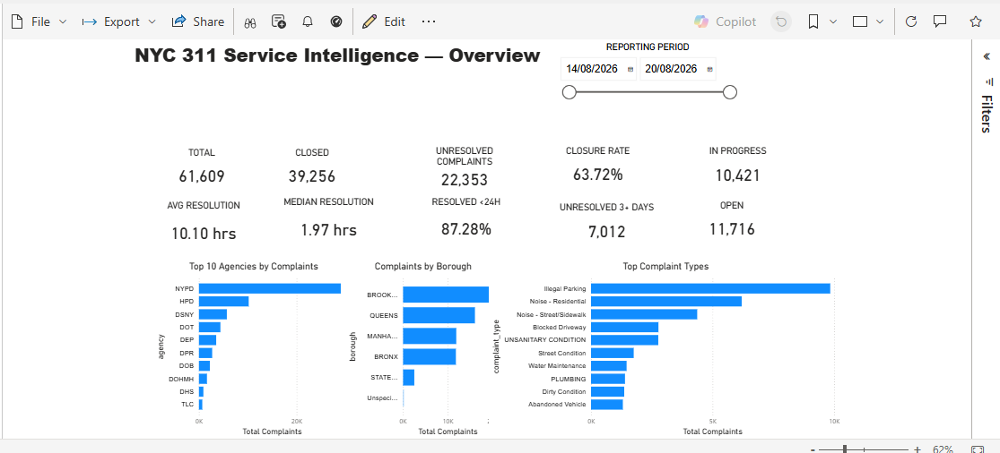
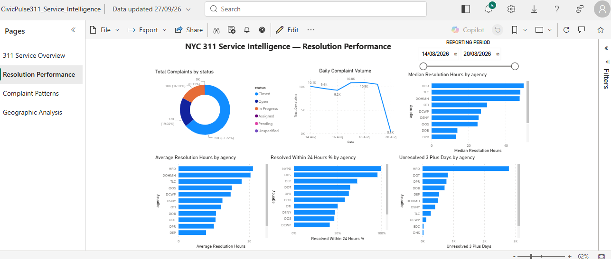
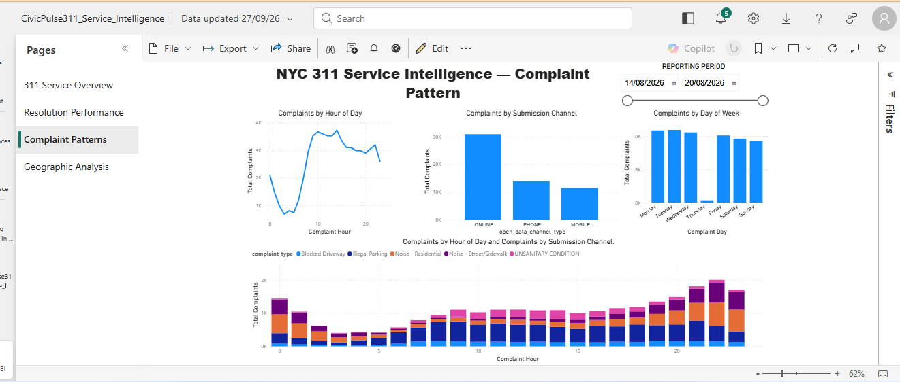
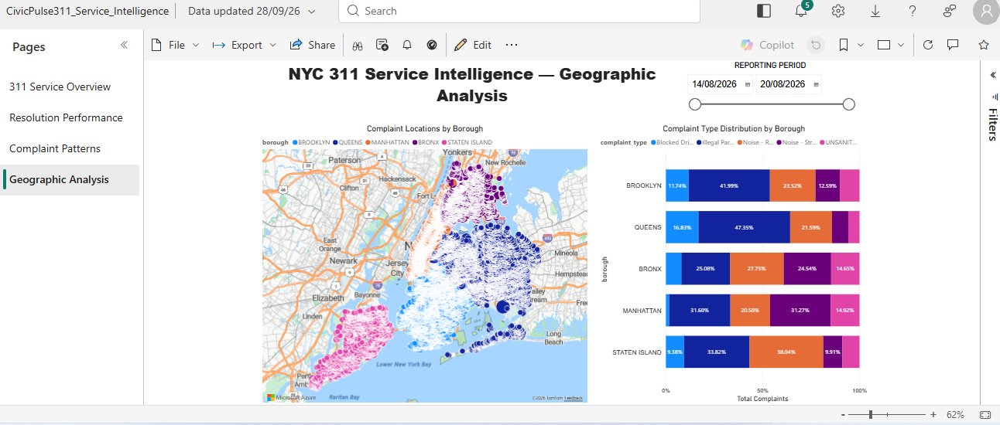

# CivicPulse311 Service Intelligence

**End-to-end NYC 311 data engineering and service-intelligence project**

CivicPulse311 turns public NYC 311 service-request data into an analytics-ready reporting layer and a four-page Power BI service-intelligence dashboard.

The project demonstrates the full path from API ingestion and orchestration through Azure storage, transformation, PostgreSQL analytics, data-quality validation, KPI design, infrastructure as code, and business reporting.

## Project Overview

City-service data is valuable only when it can be ingested reliably, validated, transformed consistently, and presented in a form that operational teams can use.

CivicPulse311 was built around that problem. The solution ingests NYC 311 service requests from the NYC Open Data API, lands source data in Azure Blob Storage, processes the data through an Azure-based pipeline, loads a curated PostgreSQL table, creates reusable SQL reporting views, and presents the results in Power BI.

**End-to-end flow**

`NYC 311 API → Apache Airflow → Azure Blob Storage → Azure Data Factory → Azure PostgreSQL → Power BI`

The project also uses **Terraform** to define core Azure infrastructure.

---

## Business Questions

The reporting layer is designed to answer practical service-management questions such as:

- How many complaints are being received and resolved?
- What proportion of complaints remains unresolved?
- Which agencies hold the largest unresolved workload?
- How long does complaint resolution take?
- How old is the outstanding backlog?
- Which complaint types occur most frequently?
- How do complaint patterns vary by borough, hour, day, and submission channel?
- Where are complaints geographically concentrated?

The aim is not simply to display 311 records, but to convert them into operational service intelligence.

---

## Architecture


### Main Components

| Layer | Technology | Responsibility |
|---|---|---|
| Source | NYC Open Data / Socrata API | Public NYC 311 service-request data |
| Ingestion | Python | API extraction, pagination, retries and incremental filtering |
| Orchestration | Apache Airflow / Astro | Executes ingestion with retry controls and checkpoint handling |
| Raw landing | Azure Blob Storage (`raw2`) | Preserves timestamped ingestion batches |
| Processing | Python / Azure Data Factory | Data selection, transformation and managed movement |
| Clean landing | Azure Blob Storage (`clean2`) | Stores cleaned Parquet output |
| Analytical store | Azure Database for PostgreSQL | Curated complaint table and reporting views |
| Analytics | SQL | Data-quality checks, exploratory analysis, KPIs and reporting views |
| Reporting | Power BI | Service overview, resolution, complaint-pattern and geographic analysis |
| Infrastructure | Terraform | Azure resource provisioning and configuration |

---

## Pipeline Design

### 1. Incremental API Ingestion

The ingestion code connects to the NYC 311 API endpoint and retrieves records in pages rather than assuming the source can be loaded in one request.

The API client:

- requests records in configurable batches;
- orders records by `created_date`;
- uses `$offset` pagination;
- filters on `created_date` when a previous checkpoint exists;
- retries HTTP `429`, `500`, `502`, `503`, and `504` responses;
- uses exponential backoff; and
- applies a request timeout.

This makes ingestion more resilient than a single unprotected API request.

### 2. Checkpoint-Based Processing

A checkpoint file records the newest successfully ingested `created_date`.

On the next run, the pipeline requests only records where:

```text
created_date > last_checkpoint
```

The checkpoint is updated only after the new API data has been written to the raw landing area.

This gives the ingestion process a simple incremental-processing mechanism and avoids repeatedly requesting the complete source dataset.

### 3. Raw Azure Blob Landing

Each ingestion batch is written to the private `raw2` Azure Blob container as a timestamped CSV file:

```text
311_service_request_YYYYMMDD_HHMMSS.csv
```

Timestamped raw files preserve individual ingestion batches rather than continually overwriting one source file.

### 4. Transformation and Clean Layer

The Python transformation stage selects the required 311 fields and standardises column names by:

- trimming whitespace;
- converting names to lowercase; and
- replacing spaces with underscores.

A clean Parquet dataset is written to the private `clean2` container as:

```text
311_service_request.parquet
```

Parquet provides a structured analytical format for the downstream Azure Data Factory pipeline.

### 5. Azure Data Factory and PostgreSQL

Terraform defines an Azure Data Factory instance, Blob Storage linked service, PostgreSQL linked service, Parquet dataset, and PostgreSQL dataset targeting:

```text
public.complaints_urban_intelligence
```

The project evidence also contains ADF pipeline/data-flow screenshots and PostgreSQL validation screenshots showing the movement and inspection of the analytical dataset.

### 6. SQL Reporting Layer

Rather than connecting Power BI only to repeated ad-hoc SQL, the project contains reusable PostgreSQL views for:

- agency summary;
- borough summary;
- status summary;
- resolution performance;
- unresolved workload; and
- unresolved ageing.

This separates reporting logic from the dashboard and creates a cleaner semantic boundary between the final analytical table and Power BI.

---

## Airflow Orchestration

The Airflow DAG is named:

```text
civicpulse_api_ingestion
```

The ingestion task:

```text
ingest_api_to_raw_blob
```

currently runs on demand (`schedule=None`) and includes:

- 3 task retries;
- a 2-minute retry delay; and
- exponential retry backoff.

The orchestration flow is:

```text
Read checkpoint
      ↓
Request records newer than checkpoint
      ↓
No records? ── Yes ──→ End safely
      │
      No
      ↓
Write timestamped batch to Azure Blob raw2
      ↓
Find newest created_date
      ↓
Write new checkpoint
      ↓
Complete
```

The repository includes an Airflow DAG-success screenshot as execution evidence.

---

## Data Quality and Validation

Data quality is treated as part of the pipeline rather than as a dashboard-only concern.

The SQL validation script checks:

- final row count;
- duplicate `unique_key` values;
- important-field completeness;
- missing BBL and coordinates;
- created/closed date completeness;
- cases where `closed_date < created_date`; and
- the severity of timestamp anomalies.

### Validated Dataset Snapshot

| Check | Result |
|---|---:|
| Final rows | 61,609 |
| Unique complaints | 61,609 |
| Duplicate `unique_key` records | 0 |
| Missing `created_date` | 0 |
| Missing borough | 0 |
| Missing BBL | 7,908 |
| Missing latitude | 1,264 |
| Missing longitude | 1,264 |
| Minor negative timestamp differences (≤ 1 minute) | 58 |
| Significant negative timestamp differences (> 1 minute) | 2 |

The project deliberately retains records with missing coordinates because those records can still support agency, complaint, borough, status, and temporal analysis.

Invalid negative resolution durations are excluded from resolution-time calculations rather than being allowed to distort operational KPIs.

---

## Business KPI Logic

The SQL layer defines operational measures for resolution performance and unresolved workload.

A key design decision is to report both **average** and **median** resolution time. The underlying analysis shows that the distribution is skewed: a smaller number of long-running complaints can raise the average considerably, while the median better represents the middle complaint.

For unresolved-ageing analysis, the project uses the dataset's maximum `created_date` as the snapshot date instead of `CURRENT_DATE`. This keeps the historical analysis reproducible even after the original Azure environment is no longer running.

The validated SQL analysis identified **22,353 unresolved complaints**, including **7,012 aged more than three days** in the captured dataset.

---

## Power BI Service Intelligence Dashboard

The final Power BI report contains four analytical pages.

### 1. 311 Service Overview



Provides the management-level view of complaint demand and service status.

The published dashboard snapshot shows:

- **61,609** total complaints;
- **39,256** closed complaints;
- **22,353** unresolved complaints;
- **63.72%** closure rate;
- **10,421** in progress; and
- **11,716** open.

It also surfaces agency volume, borough demand, complaint types, resolution indicators, and backlog measures.

### 2. Resolution Performance



Focuses on how quickly service requests are resolved and how outstanding workload is ageing.

The page is designed to support investigation of resolution behaviour without assuming that agencies are directly comparable: agencies handle different complaint categories and operational processes.

### 3. Complaint Patterns



Explores when and how complaints are submitted, including:

- complaint volume by hour of day;
- submission channel;
- day-level patterns; and
- complaint-type composition across time.

This page helps expose temporal demand patterns that are less visible in headline totals.

### 4. Geographic Analysis



Combines complaint locations with borough-level complaint-type distribution to show where demand is concentrated geographically.

The report uses a reporting-period slicer so the same analytical pages can be explored for the required date range.

---

## Live Power BI Report

A public portfolio version of the CivicPulse311 report has been published through Power BI.

**Live report:**  
https://app.powerbi.com/view?r=eyJrIjoiZmNlZmY2OGYtN2QwMy00NzAzLWJlOWQtNmVlODBiZDE3ZTNlIiwidCI6ImYxMWQwYzNhLTNjMmUtNDQxYS1iNTdkLTBjZjEwYzJjMTlmNiJ9

> **Public-report note:** Power BI “Publish to web” makes the report accessible on the public internet. Only non-confidential portfolio data should be exposed through this link.

---

## Infrastructure as Code

Terraform is used to define core Azure resources, including:

- Resource Group
- Storage Account
- private `raw2` Blob container
- private `clean2` Blob container
- Azure Data Factory
- Azure Database for PostgreSQL Flexible Server
- PostgreSQL database
- Blob Storage linked service
- PostgreSQL linked service
- Parquet dataset
- PostgreSQL dataset

The configuration uses **Canada Central** as the declared Azure region in the reviewed Terraform variables.

### Security Note

The reviewed development copy contains local infrastructure and configuration artefacts such as `.env`, `terraform.tfvars`, Terraform state/plan files, and `credentials.txt`.

These files **must not be committed to a public repository**.

A public repository should ignore at least:

```gitignore
# Secrets and local configuration
.env
.env.*
credentials.txt
*.tfvars

# Terraform state and plans
*.tfstate
*.tfstate.*
tfplan
tfplan*
.terraform/

# Python / Airflow local files
__pycache__/
*.py[cod]
.venv/
venv/
airflow.db
airflow.cfg
airflow-webserver.pid

# OS / editor files
.DS_Store
._*
```

Any credentials that have previously been committed to Git should be rotated and removed from Git history; adding them to `.gitignore` does not remove an already committed secret.

The current Terraform development configuration also contains an open PostgreSQL firewall rule (`0.0.0.0`–`255.255.255.255`). That is convenient during development but should be replaced by restricted network access before treating the environment as production-ready.

---

## Repository Structure

The reviewed project contains the following main components:

```text
urbanIntelligence/
│
├── airflow_orchestration/
│
├── powerbi/
│   ├── CivicPulse311_Service_Intelligence.pbix
│   ├── service_intelligence_Overview.png
│   ├── service_intelligence_resolution.png
│   ├── service_intelligence_complaint.png
│   └── service_intelligence_geographic.png
│
├── screenshots/
│   └── pipeline, PostgreSQL, ADF and Airflow evidence
│
├── terraform/
│   ├── main.tf
│   ├── provider.tf
│   └── variables.tf
│
└── venv/
    ├── airflow_orchestration/
    │   ├── dags/
    │   │   └── civicpulse_ingestion_dag.py
    │   ├── include/
    │   │   ├── api_connect.py
    │   │   ├── checkpoint.py
    │   │   ├── load_to_data_lake.py
    │   │   └── sql/
    │   │       ├── 01_data_quality_checks.sql
    │   │       ├── 02_exploratory_analysis.sql
    │   │       ├── 03_business_kpis.sql
    │   │       └── 04_reporting_views.sql
    │   └── requirements.txt
    │
    ├── src/
    │   ├── main.py
    │   ├── extract_from_data_lake.py
    │   ├── transform_data.py
    │   └── load_clean_data_to_data_lake.py
    │
    └── doc/images/
        └── architecture.png
```

> The current development copy contains duplicated/nested working folders. A final GitHub cleanup should move application code out of `venv/` and keep the Python virtual environment itself outside version control.

A cleaner target structure would be:

```text
civicpulse311/
├── README.md
├── airflow_orchestration/
│   ├── dags/
│   ├── include/
│   └── requirements.txt
├── src/
├── sql/
├── terraform/
├── powerbi/
├── docs/
│   └── images/
└── screenshots/
```

---

## Running the Airflow Project Locally

The Airflow portion was created as an Astro project.

### Requirements

- Python
- Docker
- Astronomer CLI
- Azure Storage access/configuration
- required environment variables
- internet access to the NYC Open Data API

Install project Python dependencies through the Astro project configuration. The reviewed `requirements.txt` includes:

```text
requests
pandas
python-dotenv
azure-storage-blob
```

Start the local Airflow environment from the Astro project directory:

```bash
astro dev start
```

The local Airflow UI is then normally available at:

```text
http://localhost:8080
```

Trigger:

```text
civicpulse_api_ingestion
```

and verify that the `ingest_api_to_raw_blob` task completes successfully and that a new timestamped file appears in the `raw2` Blob container.

> Environment-specific secrets are intentionally not documented in this README.

---

## SQL Analysis Files

The repository separates SQL work by purpose:

```text
01_data_quality_checks.sql
```

Validates completeness, uniqueness and timestamp logic.

```text
02_exploratory_analysis.sql
```

Supports investigation of the curated 311 dataset before KPI design.

```text
03_business_kpis.sql
```

Defines operational measures for resolution performance, unresolved workload and backlog ageing.

```text
04_reporting_views.sql
```

Creates reusable PostgreSQL views consumed by the reporting layer.

This progression follows:

```text
LOAD → VALIDATE → EXPLORE → DEFINE KPIs → CREATE REPORTING VIEWS → VISUALISE
```

---

## Evidence Included in the Project

The repository contains screenshots demonstrating stages of the implementation, including:

- PostgreSQL table and row-count validation;
- reporting views;
- agency-performance analysis;
- Azure Data Factory pipeline/data-flow work;
- Azure Blob clean-layer output;
- successful Airflow DAG execution; and
- the completed four-page Power BI report.

These artefacts are retained as implementation evidence rather than being used as substitutes for the actual code.

---

## Design Decisions Demonstrated

This project intentionally includes several engineering decisions that go beyond simply moving data from one system to another:

**Incremental ingestion** — checkpointing reduces unnecessary full-source extraction.

**Resilient API access** — retry handling covers throttling and transient server errors.

**Immutable-style raw batches** — timestamped raw filenames preserve ingestion history.

**Separation of raw and clean zones** — `raw2` and `clean2` distinguish source landing from processed data.

**Parquet for the clean layer** — structured analytical output is used downstream.

**Data-quality controls** — duplicates, nulls and invalid timestamp relationships are explicitly tested.

**Preserve useful incomplete records** — missing coordinates do not cause otherwise useful complaints to be discarded.

**Average plus median** — resolution-time reporting avoids relying on a single potentially skewed measure.

**Reproducible ageing logic** — dataset snapshot time is used instead of today's date.

**Reusable SQL views** — Power BI is supported by a reporting layer rather than repeated one-off queries.

**Infrastructure as code** — Azure components are represented in Terraform rather than existing only as manually configured portal resources.

---

## Current Scope and Limitations

The repository demonstrates a working portfolio pipeline, but it should not be represented as a production municipal platform.

Current limitations visible in the reviewed implementation include:

- the Airflow DAG is manually triggered rather than scheduled;
- checkpoint state is file-based;
- the clean Parquet writer currently targets a fixed filename;
- some transformation code exists separately from the active Airflow ingestion DAG;
- the Terraform development firewall rule is intentionally broad and needs hardening;
- local secrets/state artefacts require repository cleanup before public publication; and
- monitoring, automated end-to-end tests and production alerting are not yet implemented.

Keeping these boundaries explicit makes the project easier to explain accurately in technical interviews.

---

## Next Improvements

The strongest next engineering improvements are:

1. **Repository/security cleanup** — remove virtual-environment files, secrets, state and plans from version control; add a root `.gitignore`; rotate any exposed credentials.
2. **Integrate the full transformation path into Airflow** — orchestrate raw ingestion, clean transformation, ADF/database processing and validation as explicit tasks.
3. **Move checkpoint state out of a local text file** — use durable metadata storage suitable for distributed execution.
4. **Add automated tests** — unit-test API/checkpoint logic and add SQL/data-quality tests for the final dataset.
5. **Harden Azure networking** — replace the open PostgreSQL firewall rule with restricted access/private networking appropriate to the deployment.
6. **Add observability** — capture row counts, ingestion timestamps, failures, data freshness and pipeline duration.
7. **Parameterise environments** — separate development/test/production Terraform configuration rather than relying on local values.
8. **Add CI validation** — run Python tests, formatting/linting and Terraform validation through a CI pipeline.

---

## Skills Demonstrated

**Data Engineering:** Python, REST API ingestion, pagination, incremental loading, checkpointing, retry strategies, Pandas, CSV, Parquet

**Orchestration:** Apache Airflow, Astronomer/Astro, task retries, execution monitoring

**Azure:** Blob Storage, Azure Data Factory, Azure Database for PostgreSQL

**SQL & Analytics:** PostgreSQL, data-quality validation, exploratory analysis, window functions, percentiles, KPI development, reusable reporting views

**Business Intelligence:** Power BI, operational KPIs, temporal analysis, geographic analysis, interactive reporting

**Infrastructure & Engineering:** Terraform, Docker-based local Airflow development, infrastructure as code, security and deployment considerations

---

## Project Status

The reviewed project demonstrates the end-to-end portfolio flow from NYC 311 source ingestion through cloud storage, orchestration, PostgreSQL analytics and a completed Power BI reporting layer.

The Power BI report has four completed analytical pages and a public portfolio version. The remaining work is primarily **repository hardening, stronger automation/testing, and production-style operational controls**, rather than creating another dashboard.

---

## Author

**Mukaila Adesina**

Data Engineering | BI Development | Analytics Engineering

GitHub: https://github.com/madesina2025
